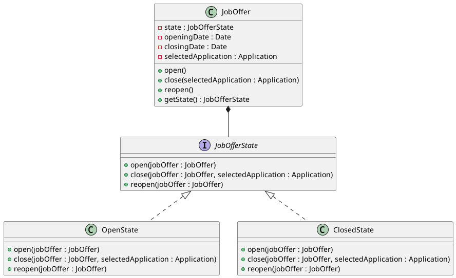

# CAT 1
Alejandro Pérez Bueno
May 21, 2024

- [Question 1](#question-1)
  - [a) Responsibility Patterns](#a-responsibility-patterns)
  - [b) Class Diagram](#b-class-diagram)
- [Question 2](#question-2)
  - [a) Design Patterns](#a-design-patterns)
  - [b) Static Class Diagram](#b-static-class-diagram)
  - [c) Pseudocode](#c-pseudocode)
- [Question 3](#question-3)
  - [a) Design Patterns](#a-design-patterns-1)
  - [b) Class Diagram](#b-class-diagram-1)
  - [c) Sequence Diagram](#c-sequence-diagram)
- [Question 4](#question-4)
  - [a) Design Patterns](#a-design-patterns-2)
  - [b) Class Diagram](#b-class-diagram-2)



## Question 1

### a) Responsibility Patterns

Here are the responsibility patterns to add the application
functionality:

- Information Expert: The classes that hold the necessary information to
  perform a task should be responsible for that task.
  - Offer: An Offer should know about its applications. It’s the expert
    for retrieving and deleting applications associated with it.
  - User: A User should know about the offers they’ve applied for. It’s
    the expert for retrieving and deleting its own applications.
- Creator: The class that contains or aggregates instances of another
  class should be responsible for creating those instances.
  - Offer: Since an Offer will contain a collection of applications, it
    should be responsible for creating new Application instances.
- Controller: A controller class should handle system events and
  delegate tasks to appropriate domain objects.
  - Application: we need a controller to manage user actions related to
    applications, such as adding, retrieving, and deleting applications.

### b) Class Diagram


> [!TIP]
>
> ### Main takeaways
>
> - The Application class holds the application data (Information Expert
>   pattern).
> - The User class is responsible for creating Application instances
>   (Creator pattern).
> - The ApplicationController class manages user actions related to
>   applications (Controller pattern).

## Question 2

### a) Design Patterns

We can leverage the following design patterns:

- **Observer Pattern**: This is the core pattern for managing
  notifications.
  - The companies become the **Subject**. When a company creates a new
    job offer, it will notify its Observers (the users who have selected
    that company as a favorite).
  - Users become the **Observers**. They register their interest in
    receiving notifications from specific companies.
- **Singleton Pattern**: This pattern ensures that we have only one
  instance of the server throughout the application, providing a single
  point of access for sending notifications.

Why Observer Pattern is Ideal for Notifications

- Decoupling: The Observer pattern excels at decoupling the objects
  involved in the notification process.
  - Companies don’t need to know about specific users: A company simply
    announces that a new job offer exists. It doesn’t need to keep track
    of which users are interested in its offers.
  - Users don’t need to know how companies manage offers: Users simply
    express their interest in a company. They don’t need to know the
    internal mechanisms of how companies create or store job offers.
- Open/Closed Principle: The Observer pattern adheres to the open/closed
  principle, making the system very extensible.
  - Adding new types of observers is easy: We could introduce new types
    of observers (e.g., a third-party job board that wants to be
    notified of new offers) without modifying the existing Company or
    User classes.
  - Changing notification mechanisms is straightforward: If we wanted to
    switch from push notifications to email alerts, we could modify the
    NotificationServer and the User.receiveNotification() method without
    affecting the core notification logic.
- Dynamic Relationships: The Observer pattern handles dynamic
  relationships between companies and users gracefully.
  - Users can subscribe and unsubscribe at any time: The selectCompany()
    and unselectCompany() methods allow users to dynamically manage
    their notification preferences.
  - Companies can have varying numbers of observers: The number of users
    interested in a company’s job offers can fluctuate without requiring
    changes to the underlying notification system.

However, without the Observer pattern, we’d likely end up with tightly
coupled code where companies directly manage lists of users and their
notification preferences. This would be harder to maintain, less
flexible, and more prone to errors.

### b) Static Class Diagram




### c) Pseudocode

<div class="code-with-filename">

**company.py**

``` python
class Company:
  def __init__(self, name):
    self.name = name
    self.observers = []
    self.jobOffers = []

  def createJobOffer(self, title):
    jobOffer = JobOffer(title)
    self.jobOffers.append(jobOffer)
    self.notifyObservers(title)

  def addObserver(self, observer):
    self.observers.append(observer)

  def removeObserver(self, observer):
    self.observers.remove(observer)

  def notifyObservers(self, title):
    for observer in self.observers:
      observer.receiveNotification(title)
```

</div>

<div class="code-with-filename">

**user.py**

``` python
class User:
  def __init__(self, email):
    self.email = email

  def selectCompany(self, company):
    company.addObserver(self)

  def unselectCompany(self, company):
    company.removeObserver(self)

  def receiveNotification(self, title):
    notificationServer = NotificationServer.getInstance()
    notificationServer.sendNotification(self.email, title)
```

</div>

<div class="code-with-filename">

**job_offer.py**

``` python
class JobOffer:
  def __init__(self, title):
    self.title = title
```

</div>

<div class="code-with-filename">

**notification_server.py**

``` python
class NotificationServer:
  __instance = None

  @staticmethod
  def getInstance():
    if NotificationServer.__instance == None:
      NotificationServer()
    return NotificationServer.__instance

  def __init__(self):
    if NotificationServer.__instance != None:
      raise Exception("This class is a singleton!")
    else:
      # ... Initialization of the server connection ...
      NotificationServer.__instance = self

  def sendNotification(self, dest, title):
    # ... Logic to send the push notification using the server ...
    print(f"Notification sent to {dest}: {title}")
```

</div>



## Question 3

### a) Design Patterns

We can apply the following design patterns:

- **Strategy**: This pattern allows us to define a family of algorithms
  (in this case, the calculation of the average number of applications
  per offer) and make them interchangeable. This is useful because the
  calculation might change in the future, and we want to be able to
  adapt easily without modifying existing classes.
- **Facade**: We are provided with a SystemFacade class to access the
  domain entities. This facade simplifies the interaction with the
  system and reduces coupling between the new functionality and the
  existing classes.
- **Singleton**: The SystemFacadeImplementation is a singleton, ensuring
  that there is only one instance of the facade throughout the system.
  This is beneficial for managing access to the domain entities and
  maintaining consistency.

### b) Class Diagram


### c) Sequence Diagram


## Question 4

### a) Design Patterns

The most suitable design pattern for this scenario is the **State**
pattern. Here’s why:

- **Changing Behavior**: The core requirement is to model the dynamic
  behavior of a job offer, which can be either open or closed. This
  directly translates to different states of the offer, each with its
  own set of permissible actions.
- **Conditional Logic**: The statement mentions exceptions for closing
  an already closed offer and opening an already open offer. This
  suggests the presence of conditional logic based on the offer’s state,
  which the State pattern helps to eliminate.
- **Reopening Offers**: The possibility of reopening a closed offer
  further emphasizes the need for a state-based approach. The State
  pattern allows for smooth transitions between states, including
  reopening. Storing State Information: The requirement to store
  opening/closing dates and the selected application aligns well with
  the State pattern, where each state can hold relevant data

### b) Class Diagram


