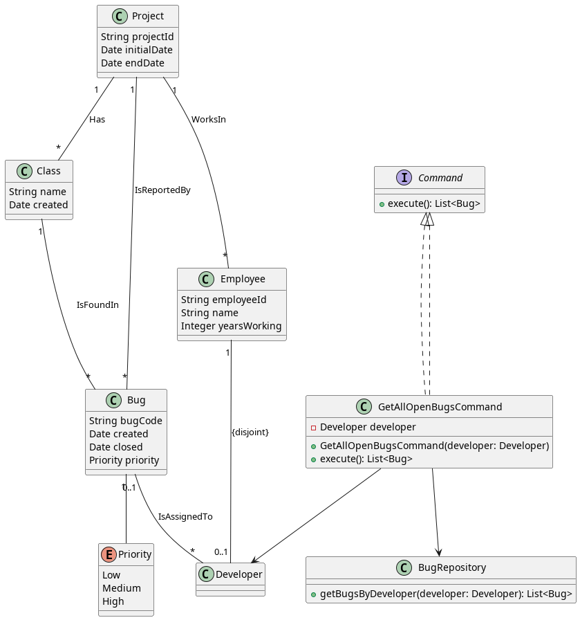
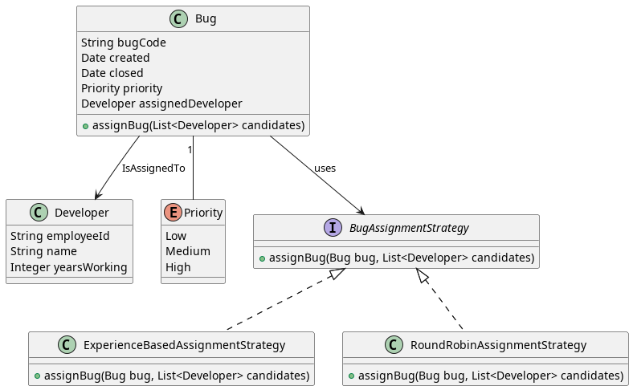
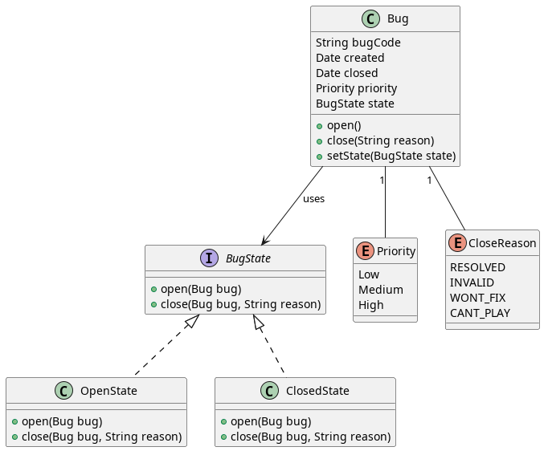
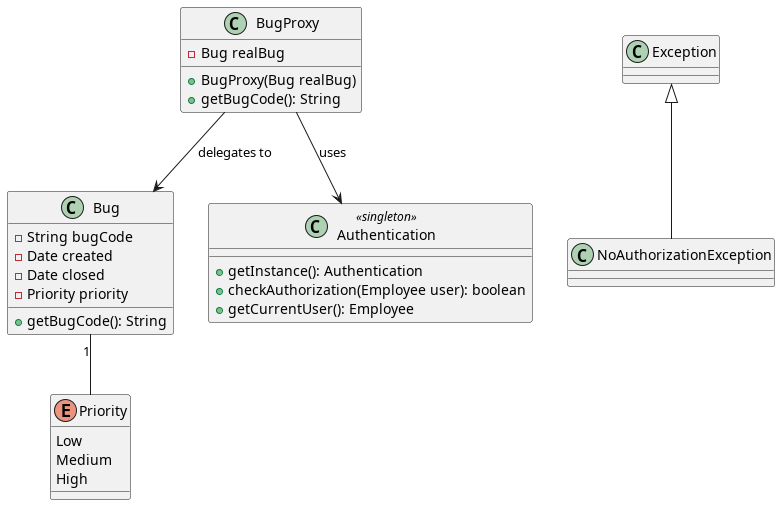

# Prac 1
Alejandro Pérez Bueno
Jun 18, 2024

- [Question 1](#question-1)
  - [a)](#a)
  - [b)](#b)
  - [c)](#c)
- [Question 2](#question-2)
  - [a)](#a-1)
  - [b)](#b-1)
  - [c)](#c-1)
- [Question 3](#question-3)
  - [a)](#a-2)
  - [b)](#b-2)
  - [c)](#c-2)
- [Question 4](#question-4)
  - [a)](#a-3)
  - [b)](#b-3)
  - [c)](#c-3)



## Question 1

### a)

To implement the getAllOpenBugs functionality while maintaining low
coupling, the Command Pattern is a suitable choice. The Command Pattern
encapsulates a request as an object, thereby allowing for
parameterization of clients with queues, requests, and operations. This
pattern will help in decoupling the sender and receiver of the request,
making the system more flexible and easier to extend.

### b)



### c)

``` cpp
interface Command {
    List<Bug> execute();
}

class GetAllOpenBugsCommand implements Command {
    private Developer developer;
    private BugRepository bugRepository;

    public GetAllOpenBugsCommand(Developer developer, BugRepository bugRepository) {
        this.developer = developer;
        this.bugRepository = bugRepository;
    }

    @Override
    public List<Bug> execute() {
        return bugRepository.getBugsByDeveloper(developer).stream()
                            .filter(bug -> bug.getClosed() == null)
                            .collect(Collectors.toList());
    }
}

class BugRepository {
    private List<Bug> bugs;

    public BugRepository(List<Bug> bugs) {
        this.bugs = bugs;
    }

    public List<Bug> getBugsByDeveloper(Developer developer) {
        return bugs.stream()
                   .filter(bug -> bug.getAssignedDeveloper().equals(developer))
                   .collect(Collectors.toList());
    }
}

class Bug {
    private String bugCode;
    private Date created;
    private Date closed;
    private Priority priority;
    private Developer assignedDeveloper;

    // Getters and Setters

    public Date getClosed() {
        return closed;
    }

    public Developer getAssignedDeveloper() {
        return assignedDeveloper;
    }
}

class Developer extends Employee {
    // Developer-specific attributes and methods
}
```

## Question 2

### a)

The Strategy Pattern is the most appropriate design pattern, as it
allows you to define a family of algorithms, encapsulate each one, and
make them interchangeable. This pattern lets the algorithm vary
independently from clients that use it. By using the Strategy Pattern,
we can easily add new bug assignment criteria in the future without
modifying the existing code.

### b)



### c)

``` cpp
class Bug {
    private String bugCode;
    private Date created;
    private Date closed;
    private Priority priority;
    private Developer assignedDeveloper;
    private BugAssignmentStrategy assignmentStrategy;

    public Bug(String bugCode, Date created, Priority priority, BugAssignmentStrategy assignmentStrategy) {
        this.bugCode = bugCode;
        this.created = created;
        this.priority = priority;
        this.assignmentStrategy = assignmentStrategy;
    }

    public void assignBug(List<Developer> candidates) {
        assignmentStrategy.assignBug(this, candidates);
    }

    // Getters and Setters

    public Priority getPriority() {
        return priority;
    }

    public void setAssignedDeveloper(Developer developer) {
        this.assignedDeveloper = developer;
    }
}

class Developer {
    private String employeeId;
    private String name;
    private Integer yearsWorking;

    public Developer(String employeeId, String name, Integer yearsWorking) {
        this.employeeId = employeeId;
        this.name = name;
        this.yearsWorking = yearsWorking;
    }

    // Getters and Setters

    public Integer getYearsWorking() {
        return yearsWorking;
    }
}

interface BugAssignmentStrategy {
    void assignBug(Bug bug, List<Developer> candidates);
}

class ExperienceBasedAssignmentStrategy implements BugAssignmentStrategy {
    @Override
    public void assignBug(Bug bug, List<Developer> candidates) {
        Developer selectedDeveloper = null;
        if (bug.getPriority() == Priority.High) {
            selectedDeveloper = candidates.stream()
                                          .filter(dev -> dev.getYearsWorking() > 5)
                                          .findFirst()
                                          .orElse(null);
        } else {
            selectedDeveloper = candidates.stream()
                                          .filter(dev -> dev.getYearsWorking() <= 5)
                                          .findFirst()
                                          .orElse(null);
        }
        bug.setAssignedDeveloper(selectedDeveloper);
    }
}

class RoundRobinAssignmentStrategy implements BugAssignmentStrategy {
    private int currentIndex = 0;

    @Override
    public void assignBug(Bug bug, List<Developer> candidates) {
        if (candidates.isEmpty()) return;
        Developer selectedDeveloper = candidates.get(currentIndex);
        bug.setAssignedDeveloper(selectedDeveloper);
        currentIndex = (currentIndex + 1) % candidates.size();
    }
}
```

## Question 3

### a)

I would choose the State Pattern, since it allows for an object to alter
its behavior when its internal state changes. This pattern encapsulates
state-specific behavior and transitions, making it easier to manage and
extend the life cycle of bugs.

### b)



### c)

``` cpp
class Bug {
    private String bugCode;
    private Date created;
    private Date closed;
    private Priority priority;
    private BugState state;

    public Bug(String bugCode, Date created, Priority priority) {
        this.bugCode = bugCode;
        this.created = created;
        this.priority = priority;
        this.state = new OpenState();
    }

    public void open() {
        state.open(this);
    }

    public void close(String reason) {
        state.close(this, reason);
    }

    public void setState(BugState state) {
        this.state = state;
    }

    // Getters and Setters
}

interface BugState {
    void open(Bug bug);
    void close(Bug bug, String reason);
}

class OpenState implements BugState {
    @Override
    public void open(Bug bug) {
        // Already open, no state change
    }

    @Override
    public void close(Bug bug, String reason) {
        bug.setState(new ClosedState());
        bug.setClosed(new Date());
        // Log reason for closing
    }
}

class ClosedState implements BugState {
    @Override
    public void open(Bug bug) {
        bug.setState(new OpenState());
        bug.setClosed(null);
        // Log reopening
    }

    @Override
    public void close(Bug bug, String reason) {
        // Already closed, no state change
    }
}
```

## Question 4

### a)

The most suitable design pattern for this security requirement is the
Proxy Pattern. The Proxy Pattern provides a surrogate or placeholder for
another object to control access to it. In this case, we can introduce a
proxy class that intercepts calls to sensitive bug functions and
performs authorization checks before delegating the calls to the actual
bug object.

### b)



### c)

``` cpp
class NoAuthorizationException extends Exception {
    public NoAuthorizationException(String message) {
        super(message);
    }
}

class Bug {
    private String bugCode;
    private Date created;
    private Date closed;
    private Priority priority;

    public Bug(String bugCode, Date created, Priority priority) {
        this.bugCode = bugCode;
        this.created = created;
        this.priority = priority;
    }

    public String getBugCode() {
        return bugCode;
    }

    // Other methods
}

class BugProxy {
    private Bug realBug;

    public BugProxy(Bug realBug) {
        this.realBug = realBug;
    }

    public String getBugCode() throws NoAuthorizationException {
        Authentication auth = Authentication.getInstance();
        Employee currentUser = auth.getCurrentUser();
        if (auth.checkAuthorization(currentUser)) {
            return realBug.getBugCode();
        } else {
            throw new NoAuthorizationException("User is not authorized to access this information.");
        }
    }

    // Other proxy methods
}
```
